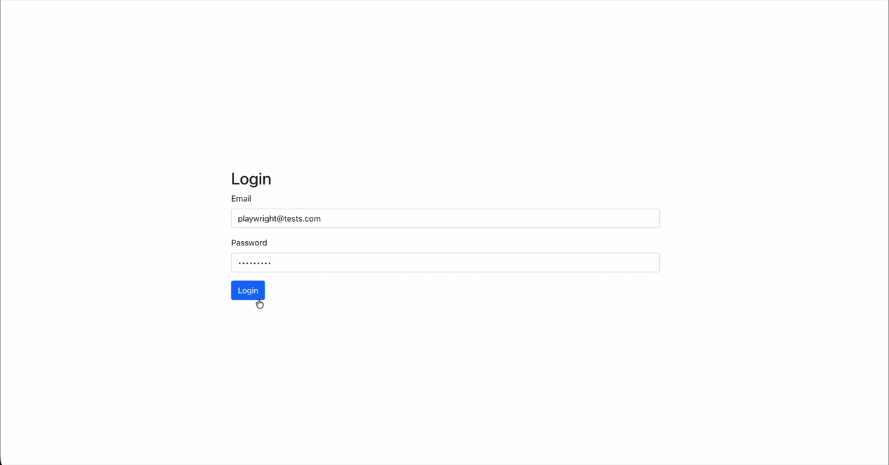
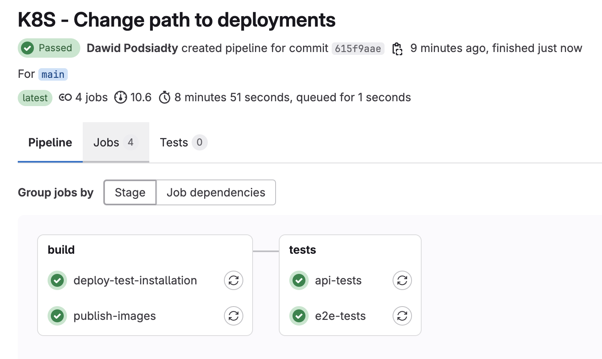
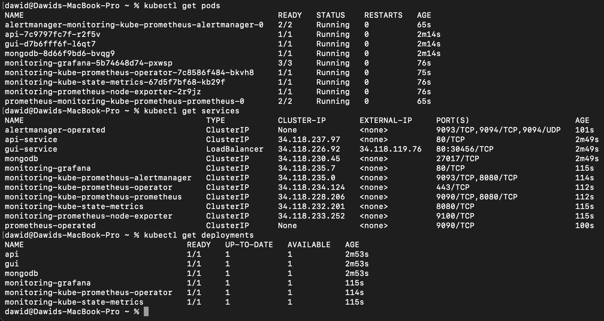
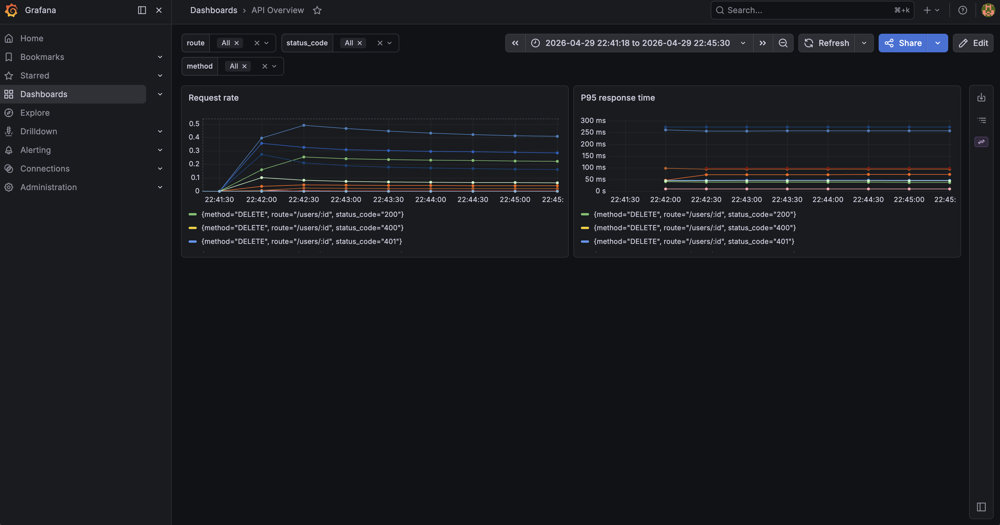

# Fully Automated Testing Process

This project demonstrates a fully automated process for building, deploying and testing a self-developed web application with GitLab CI/CD and Google Kubernetes Engine (GKE).

The application is deployed from the repository to a Kubernetes test environment and then automatically verified by both API and E2E tests executed directly in the CI/CD pipeline. The application can then be monitored using Grafana dashboards and Prometheus.

## Project Preview

### Application

### GitLab CI/CD Pipeline

### Deployment

### Monitoring

## How the Process Works

Everything is automated using GitLab pipelines. The full flow is shown below:

1. Docker images for `api` and `gui` are built
2. Docker images are pushed to `Google Artifact Registry`
3. Helm charts are packaged and published to the `OCI` registry
4. Helmfile deploys the `test-installation` environment to `Google Kubernetes Engine (GKE)`
5. `50` API tests are executed against the deployed application
6. `17` E2E tests are executed against the deployed application
7. Application health and runtime metrics are monitored with `Grafana` and `Prometheus`

## Technologies
App:
- `React`
- `Node.js`
- `Express`
- `MongoDB`

Deployment:
- `Google Kubernetes Engine (GKE)`
- `GitLab CI/CD`
- `Kubernetes`
- `Docker`
- `Helm`
- `Helmfile`
- `Terraform`

Tests:
- `Playwright` for E2E tests
- `Supertest + Jest` for API tests

Monitoring:
- `Grafana`
- `Prometheus`

## Repository Structure
- `app/api` - backend service and API deployment configuration
- `app/gui` - frontend application and GUI deployment configuration
- `tests/api` - API tests
- `tests/e2e` - E2E tests
- `deployment` - shared deployment, monitoring and infrastructure configuration

## How to Run the Project
Detailed instructions for running the application, tests, deployment and monitoring are available in the module READMEs:
- backend: [API](app/api/README.md)
- frontend: [GUI](app/gui/README.md)
- API tests: [API Tests](tests/api/README.md)
- E2E tests: [E2E Tests](tests/e2e/README.md)
- deployment and monitoring: [Deployment](deployment/README.md)
- supporting infrastructure: [Terraform](deployment/terraform/README.md)
